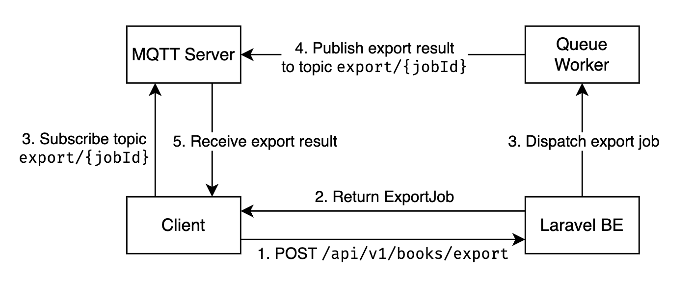

## Requirements
- [Docker](https://docs.docker.com/install)
- [Docker Compose](https://docs.docker.com/compose/install)

## Setup
1. Clone the repository.
2. Start the containers by running `docker-compose up -d` in the project root.
3. Install the composer packages by running `docker-compose exec laravel composer install`.
4. Access the Laravel instance on `http://localhost` (If there is a "Permission denied" error, run `docker-compose exec laravel chown -R www-data storage`).

Note that the changes you make to local files will be automatically reflected in the container. 

## Persistent database
If you want to make sure that the data in the database persists even if the database container is deleted, add a file named `docker-compose.override.yml` in the project root with the following contents.
```
version: "3.7"

services:
  mysql:
    volumes:
    - mysql:/var/lib/mysql

volumes:
  mysql:
```
Then run the following.
```
docker-compose stop \
  && docker-compose rm -f mysql \
  && docker-compose up -d
``` 

## Export Feature
This feature uses Laravel's queue worker to process exports asynchronously, providing a smooth and efficient user experience.

### System Architecture


### Why Use MQTT?
1. **PubSub Architecture**: This feature requires a publish/subscribe messaging pattern where:
   - The frontend only **subscribes** to topic
   - The server (queue worker) is responsible for **publishing** messages to specific topics
2. **Controller Communication**:
   - Unlike regular WebSocket, MQTT allows **fine-grained control** over message flow.
   - The frontend cannot send messages to the server, ensuring **stricter security** and adherence to the pub/sub model.
3. **Efficient Messaging Protocol**:
   - [MQTT](https://mqtt.org/) is lightweight and optimized for low-bandwidth scenarios, making it an excellent choice for real-time data delivery.

By using MQTT over WebSocket, we achieve a secure, efficient, and purpose-specific messaging system tailored to this feature's needs.

## Demo
You can access the live demo of this application at the following link:

[https://yaraku.farrelanshary.com/](https://yaraku.farrelanshary.com/)